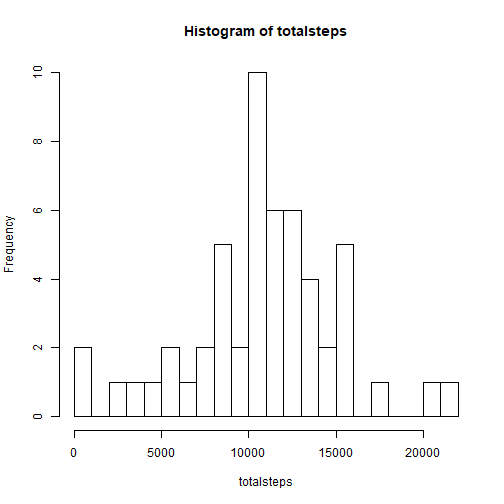
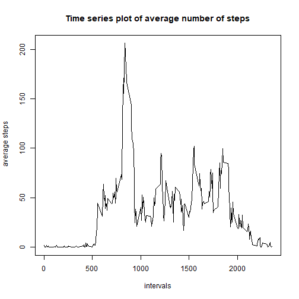
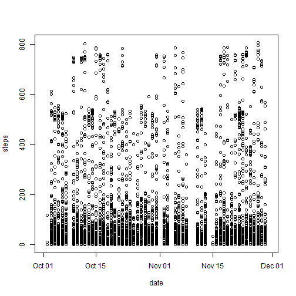
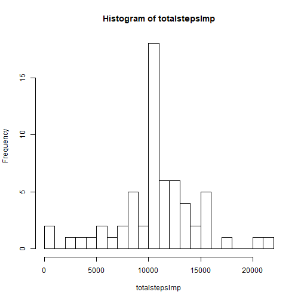
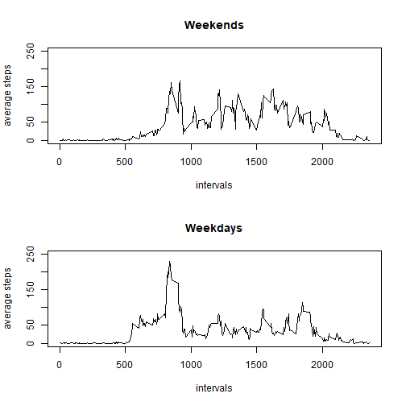

# Reproducible Research - Assignment 1

<br/><br/>

### 1. Reading and processing the data


```r
unzip("activity.zip")
activity <- read.csv("activity.csv")
activity$date <- as.Date(activity$date)
activity$steps <- as.numeric(activity$steps) # the later inserted mean for NAs is numeric
activity$interval <- as.factor(activity$interval)
```

<br/>

### 2. Histogram of the total number of steps taken per day

The NAs are not removed within the function, because if you did so, there would be some days with 0 totalsteps although we actually don't have any number for these days; this would also falsify the mean and median.

```r
totalsteps <- with(activity, tapply(steps, date, sum))
hist(totalsteps, breaks=30) # set breaks=30 to see a finer segmentation
```



<br/>

### 3. Calculate and report the mean and median of the total number of steps taken per day


```r
meansteps <- mean(totalsteps, na.rm=TRUE)
meansteps
```

```
## [1] 10766.19
```

```r
mediansteps <- median(totalsteps, na.rm=TRUE)
mediansteps
```

```
## [1] 10765
```
The value for the mean total steps is 10766.19 and the median total steps amounts to 10765.

<br/>

### 4. Time series plot of the average number of steps taken in each interval across all days - The average daily activity pattern


```r
avgsteps <- with(activity, tapply(steps, interval, mean, na.rm=TRUE))
```
For intervals with no values (just NAs), the value is set to "0" by the function

```r
table(avgsteps>0) # We can see that 19 of the 288 intervals have a value of "0"
```

```
## 
## FALSE  TRUE 
##    19   269
```

Plot the time series plot:

```r
with(activity, plot(levels(interval), avgsteps, type="l", ylab=" average steps",
                    xlab="intervals",
                    main="Time series plot of average number of steps"))
```



<br/>

### 5. The 5-minute interval that, on average, contains the maximum number of steps


```r
which.max(avgsteps)
```

```
## 835 
## 104
```

```r
avgsteps[104]
```

```
##      835 
## 206.1698
```
Interval "835" contains the maximum number of average steps across all days with 206.1698 steps.

<br/>

### 6. Checking for and imputing missing data


```r
summary(activity) # to see where NAs exist: only "steps" contains 2304 NAs
```

```
##      steps             date               interval    
##  Min.   :  0.00   Min.   :2012-10-01   0      :   61  
##  1st Qu.:  0.00   1st Qu.:2012-10-16   5      :   61  
##  Median :  0.00   Median :2012-10-31   10     :   61  
##  Mean   : 37.38   Mean   :2012-10-31   15     :   61  
##  3rd Qu.: 12.00   3rd Qu.:2012-11-15   20     :   61  
##  Max.   :806.00   Max.   :2012-11-30   25     :   61  
##  NA's   :2304                          (Other):17202
```
The following plot shows, that there are complete days with missing values.
This plot was not part of the task, but is added for demonstration.

```r
with(activity, plot(date, steps)) # 8 days have no values for 'steps'
```



Calculate and report the total number of missing values in the data set:

```r
sum(is.na(activity$steps)) # calculate the number of rows with NAs in "steps"
```

```
## [1] 2304
```

```r
sum(is.na(activity$date)) # show that data in "date" is complete (0 NAs)
```

```
## [1] 0
```

```r
sum(is.na(activity$interval)) # show that data in "interval" is complete (0 NAs)
```

```
## [1] 0
```

Now there will occur an imputation of missing values in the variable "steps" - replacing NAs with the mean of the interval in which the observation was made. Since we have whole days with missing values, it doesn't make sense to calculate the mean of the related day.


```r
activityImp <- activity
for (i in 1:17568){if(is.na(activity$steps[i]==TRUE)) {
  int <- activityImp$interval[i]
  sub <- subset(activityImp, interval==int)
  mean <- mean(sub$steps, na.rm=TRUE)
  activityImp$steps[i] <- mean
  }
}
```
You might also round the values in "steps", but the values will be left like this now. 

<br/>

### 7. New histogram of the total number of steps taken each day


```r
totalstepsImp <- with(activityImp, tapply(steps, date, sum))
hist(totalstepsImp, breaks=30) # breaks=30 for finer segmentation
```



Calculate the new mean and median total steps:

```r
meanstepsImp <- mean(totalstepsImp)
meanstepsImp
```

```
## [1] 10766.19
```

```r
medianstepsImp <- median(totalstepsImp)
medianstepsImp
```

```
## [1] 10766.19
```

The new histogram shows that the frequencies of most numbers of total steps stay the same - however the frequency of a number of total steps between 10000 and 11000 has risen from previously 10 to 18 days.

```r
table(totalstepsImp>=10000&totalstepsImp<11000)
```

```
## 
## FALSE  TRUE 
##    43    18
```
So each of the 8 days that had just missing values, now has a number of total steps between 10000 and 11000 (i.e. 10766.19). This is not a surprise, since we imputed the mean of the related interval for each missing value. Basically, each of the 8 days now consists of the same array of values for the "steps" variable, leading to the same total number of steps for these days.
The mean total number of steps is still the same as before imputating, but the median has risen slightly and is now equal to the value of the mean. This is because we added 8 values that equal the mean and thus are slightly above the previous median, so the median shifts a bit towards the higher end of the scale, taking the value of the mean.
The estimates of the total daily numbers of steps for the remaining 53 days are still the same after imputing, because they were already complete before the imputation.

<br/>

### 8. Panel plot comparing the average number of steps taken per 5-minute interval across weekdays and weekends, using the data set "activityImp"


```r
Sys.setlocale("LC_TIME", "English")
```

```
## [1] "English_United States.1252"
```

```r
activityImp$weekdays <- weekdays(activityImp$date)
activityImp$weekdays <- as.factor(activityImp$weekdays)
index <- activityImp$weekdays=="Saturday"|activityImp$weekdays=="Sunday"
for (i in 1:17568){if(index[i]==TRUE) {
  activityImp$weekInfo[i] <- "weekend"}
  else {activityImp$weekInfo[i] <- "weekday"}
}
activityImp$weekInfo <- as.factor(activityImp$weekInfo)

par(mfrow=c(2,1))
plot(levels(activityImp$interval), with(subset(activityImp, weekInfo=="weekend"), 
      tapply(steps, interval, mean)), type="l", main="Weekends", xlab="intervals", 
      ylab="average steps", ylim=c(0,250))
plot(levels(activityImp$interval), with(subset(activityImp, weekInfo=="weekday"), 
      tapply(steps, interval, mean)), type="l", main="Weekdays", xlab="intervals", 
      ylab="average steps", ylim=c(0,250))
```



We can see clear differences in the daily activity patterns of weekends and weekdays. On weekends, the average number of steps per interval is generally a bit higher than during the week after 10:00 o'clock. Between 5:00 and 10:00 o'clock, the average number of steps is bigger during the week, with the highest peak of average steps at around 8:00 o'clock on weekdays.

The following code shows how to create and view the Markdown and html files.
I added this only to document every step and make the processes complete.

```r
library(knitr)
knit2html("PA1_template.Rmd")
browseURL("PA1_template.html")
```
